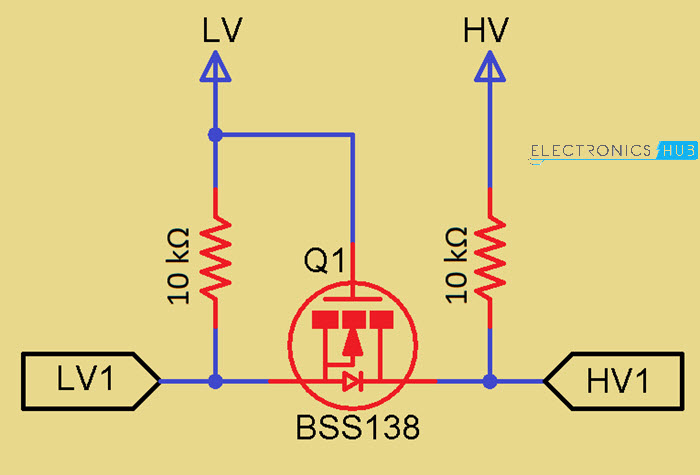
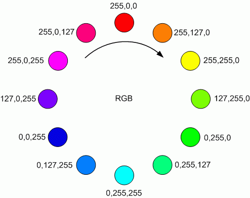

# basics-grove-lcd-nano-esp32
Grove LCD RGB Backlight V4.0 running from an Arduino Nano ESP32 via a Level Shifter.

**NOTE**: Arduino Nano ESP32 (based on the Espressif microcontroller) is a 3.3V device, whereas V4 of the Grove LCD is a 5V device.

The Grove LCD is controlled on the IC2 bus. The [IC2 protocol](https://www.robot-electronics.co.uk/i2c-tutorial) allows for [different voltage levels](https://www.electronics-tutorials.ws/connectivity/i2c-voltage-level-translators.html), however you can't mix voltages on the same device as the supply voltage will be used as a reference for whether the signal lines are high or low. Therefore it is necessary to shift the voltage level of the signal lines between devices that operate on different voltages. This is achieved with a "Level Shifter" (also know as a level converter, logic level shifter, or voltage level translator). This simple way to do this is with a MOSFET in a circuit as follows:

I used an off-the-shelf board that contains 4 of these circuits ([BOB-12009](https://www.sparkfun.com/products/12009)) from SparkFun in this example, though I only need two in this case for the SDA and SCL signals of the IC2 bus. I supplied the 5V from an external power supply and the Nano was powered from USB.

## Rainbow backlight
The Grove LCD RGB backlight can change backlight colour (that's kinda the point :) ). I wanted to do something interesting with it, so I decided to loop through all the colour combinations. I used the following diagram I [found](https://www.freestylersupport.com/wiki/tutorial:sequences_ideas:rainbow_tutorial) on the Googles to put together the algorithm you'll find in the source code.

